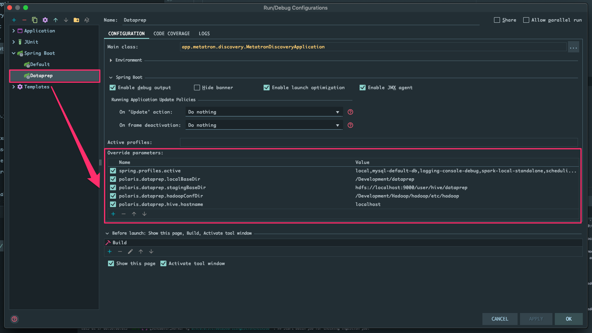
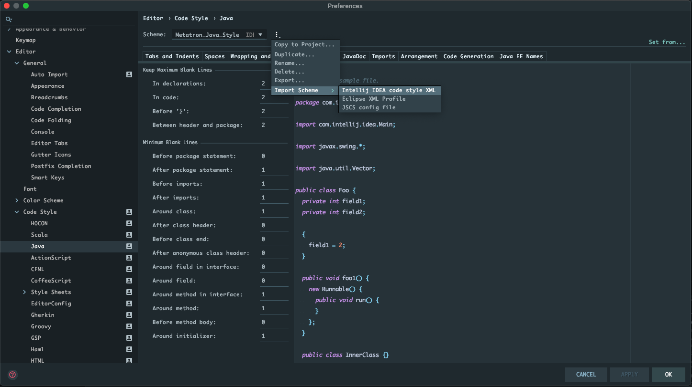
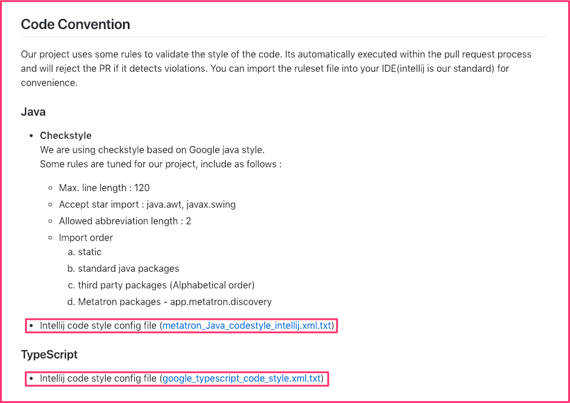

# 데이터프랩 개발환경 설정 가이드

# 1. 메타트론 개발환경 설정하기

- 참고 - [https://github.com/ninezero90hy/metatron-settings](https://github.com/ninezero90hy/metatron-settings)
- 추가
    - /Development 경로에 dataprep 디렉토리 추가

# 2. 서버 설정정보 수정 & 추가

- **수정할 파일 >** **application.yaml**

---

- 활성화할 프로필 목록
    - 맨 처음에 실행할 경우 `initial` 프로필 추가

    local,mysql-default-db,logging-console-debug,spark-local-standalone,scheduling,dataprep

- `local` 프로필 아래 추가할 설정 정보

    polaris.dataprep.localBaseDir: /Development/dataprep
    polaris.dataprep.stagingBaseDir: hdfs://localhost:9000/user/hive/dataprep
    polaris.dataprep.hadoopConfDir: /Development/Hadoop/hadoop/etc/hadoop
    polaris.dataprep.hive.hostname: localhost

# 3. Intellij 사용시 팁

- **Edit Configuration 설정하기**

    

    - 해당 설정을 사용하면 `application.yaml` 파일을 수정하지 않고 설정정보를 Override 해서 실행 가능

    - **Code Convention 관련 설정하기**

    

    - **Preferences > Editor > Code Style > Java**

        

        - metatron-discovery/.github/CONTRIBUTING.md
        README 파일에 Intellij code style config file 파일 다운로드해서 적용
        ( [https://github.com/metatron-app/metatron-discovery/blob/master/.github/CONTRIBUTING.md#java](https://github.com/metatron-app/metatron-discovery/blob/master/.github/CONTRIBUTING.md#java) )
        - Intellij에서 Java 코드스타일 적용하는 것과 동일하게
        WebStorm에서도 Typescript 코드스타일 적용도 가능 코드스타일 파일은
        [https://github.com/metatron-app/metatron-discovery/blob/master/.github/CONTRIBUTING.md#typescript](https://github.com/metatron-app/metatron-discovery/blob/master/.github/CONTRIBUTING.md#typescript) 링크 참고

# 1. 메타트론 개발환경 설정하기

- 참고 - [https://github.com/ninezero90hy/metatron-settings](https://github.com/ninezero90hy/metatron-settings)
- 추가
    - /Development 경로에 dataprep 디렉토리 추가

# 2. 서버 설정정보 수정 & 추가

- **수정할 파일 >** **application.yaml**

---

- 활성화할 프로필 목록
    - 맨 처음에 실행할 경우 `initial` 프로필 추가

    local,mysql-default-db,logging-console-debug,spark-local-standalone,scheduling,dataprep

- `local` 프로필 아래 추가할 설정 정보

    polaris.dataprep.localBaseDir: /Development/dataprep
    polaris.dataprep.stagingBaseDir: hdfs://localhost:9000/user/hive/dataprep
    polaris.dataprep.hadoopConfDir: /Development/Hadoop/hadoop/etc/hadoop
    polaris.dataprep.hive.hostname: localhost

# 3. Intellij 사용시 팁

- **Edit Configuration 설정하기**

    

    - 해당 설정을 사용하면 `application.yaml` 파일을 수정하지 않고 설정정보를 Override 해서 실행 가능

    - **Code Convention 관련 설정하기**

    

    - **Preferences > Editor > Code Style > Java**

        

        - metatron-discovery/.github/CONTRIBUTING.md
        README 파일에 Intellij code style config file 파일 다운로드해서 적용
        ( [https://github.com/metatron-app/metatron-discovery/blob/master/.github/CONTRIBUTING.md#java](https://github.com/metatron-app/metatron-discovery/blob/master/.github/CONTRIBUTING.md#java) )
        - Intellij에서 Java 코드스타일 적용하는 것과 동일하게
        WebStorm에서도 Typescript 코드스타일 적용도 가능 코드스타일 파일은
        [https://github.com/metatron-app/metatron-discovery/blob/master/.github/CONTRIBUTING.md#typescript](https://github.com/metatron-app/metatron-discovery/blob/master/.github/CONTRIBUTING.md#typescript) 링크 참고